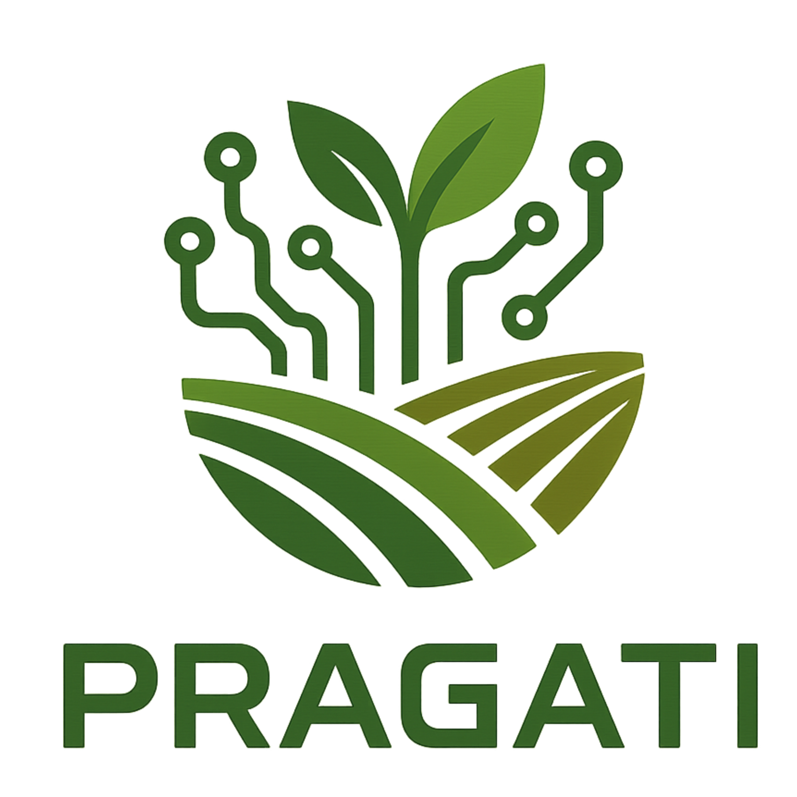
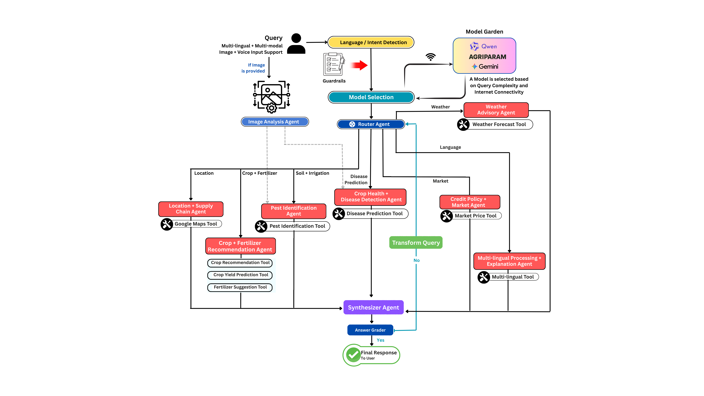
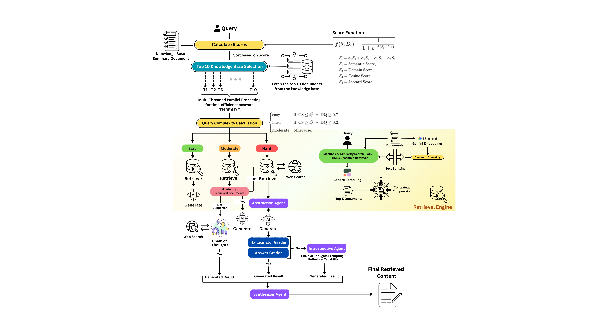

<div align="center">
  
  
  <h1>PRAGATI: Precision Retrieval & AI for Generative Agricultural Technology & Insights</h1>
</div>

---

PRAGATI is an advanced multi-agent intelligence system designed for the agricultural sector.  
The platform leverages retrieval-augmented generation (RAG) and semantic search to deliver context-aware, data-driven insights grounded in verified agricultural knowledge bases.

**Developed for the Capital One Launchpad Hackathon.**

**The Agentic AI system operates in two modes: Tooling and RAG.**

- **Tooling Mode:**  
  In Tooling Mode, a network of fine-tuned agents delivers fast, accurate answers to domain-specific agricultural questions.  
  A router agent directs queries to specialized agents for precise responses.  
  Image-based queries are handled by agents for crop disease, pest prediction, and image analysis, while text-based queries are routed to agents for crops, weather, markets, finance, translation, and logistics.  
  Together, they provide accurate, context-specific support for agricultural decision-making.

  <div align="center">
    
  </div>

- **RAG Mode:**  
  RAG Mode serves as a fallback, using retrieval-augmented generation to ensure reliability and comprehensive coverage.  
  The system ensures reliability through a multi-step retrieval pipeline.  
  Knowledge base documents are scored across semantic, domain-specific, and similarity dimensions, and only the most relevant are selected for deeper evaluation.  
  Query complexity then dictates the optimal retrieval strategy — whether direct, combined, or enhanced with web search.  
  A hybrid retrieval engine integrating FAISS and BM25, augmented with semantic chunking and re-ranking, further refines results to deliver accurate, context-aware, and trustworthy responses.  
  Multi-threading across each knowledge base retrieval pipeline accelerates response generation and enriches contextual depth, diversity, and precision.

  <div align="center">
    
  </div>

Together, these modes combine precision with scalability, enabling accurate, user-centered solutions for agricultural stakeholders.

---

### Offline Query Handling

For offline query handling, PRAGATI supports local inference using a fine-tuned model:

- **Setup:**  
  Run the `model_downloader.py` script inside utils directory to download and save the model locally.
- **Model Details:**  
  The model is fine-tuned specifically on an agricultural QnA dataset from Hugging Face, ensuring domain relevance and accuracy.
- **Usage:**  
  In offline scenarios (no internet connectivity), this local model is automatically called to generate answers.
- **Future Scope:**  
  This approach enables seamless integration into mobile applications, allowing robust agricultural AI support even without internet access.
- **Note:**  
  Due to space limitations, the large model file is not pushed directly to GitHub. Please use the provided script to download it as needed.

---

### Hallucination Removal

To ensure factual accuracy and relevance in responses, PRAGATI employs a two-step hallucination removal process:

- **Fact Checker:**  
  Detects and flags hallucinated or incorrect information in generated answers.
- **Answer Grader:**  
  Evaluates the relevance and completeness of answers, ensuring they address the user's query appropriately.

This dual-agent approach significantly reduces hallucinations and improves answer quality.  
Our RAGAS evaluation (see results below) demonstrates the effectiveness of this strategy in minimizing hallucinations and maximizing relevance.

## Key Features

- Multi-agent architecture with domain-specialized agents
- Retrieval-Augmented Generation (RAG) for accurate, context-sensitive responses, powered by a multi-threaded retrieval pipeline that simultaneously processes multiple knowledge sources
- Multi-lingual and multi-modal support (text, image, voice)
- Deep research pipelines for comprehensive analysis
- Human-in-the-loop validation for reliability
- Real-time market intelligence and weather forecasting
- Precision agriculture recommendations and insights

## Quick Start

### Prerequisites

- Docker (recommended)
- Git

### Clone the Repository

```bash
git clone https://github.com/SRINJOY59/Capital_One_Launchpad.git
cd Capital_One_Launchpad
```

### Environment Configuration

Create a `.env` file in the root directory and populate it with your API keys:

```bash
cp .env.example .env
# Edit .env with your actual API keys
```

Required API keys:

```env
GROQ_API_KEY=your_groq_api_key_here
COHERE_API_KEY=your_cohere_api_key_here
HUGGINGFACEHUB_API_TOKEN=your_huggingface_token_here
PINECONE_API_KEY=your_pinecone_api_key_here
TAVILY_API_KEY=your_tavily_api_key_here
LANGCHAIN_API_KEY=your_langchain_api_key_here
SERPER_API_KEY=your_serper_api_key_here
GOOGLE_API_KEY=your_google_api_key_here
GOOGLE_WEATHER_API_KEY=your_google_weather_api_key_here
GOOGLE_MAPS_API_KEY=your_google_maps_api_key_here
```

### Build and Run the Docker Container

```bash
# Build the Docker image
docker build -t pragati .

# Run the container
docker run -p 8080:8080 \
   --env-file .env \
   -e GOOGLE_APPLICATION_CREDENTIALS=/app/google-creds.json \
   -v $(pwd)/google-creds.json:/app/google-creds.json \
   pragati
```

### Access the Application

- API Documentation: http://localhost:8080/docs
- Health Check: http://localhost:8080/health
- Root Endpoint: http://localhost:8080/

## API Endpoints

### Core Features

- Crop Recommendations: `/api/v1/crop-recommendation`
- Disease Detection: `/api/v1/crop-disease/detect`
- Weather Forecasting: `/api/v1/weather/forecast-tool`
- Market Prices: `/api/v1/market-price`
- Pest Prediction: `/api/v1/pest-prediction`
- Crop Yield Prediction: `/api/v1/crop-yield/predict`
- Fertilizer Recommendations: `/api/v1/fertilizer/recommendation`

### AI Agents

- Multilingual Support: `/api/v1/agent/multilingual`
- Risk Management: `/api/v1/agent/risk-management`
- News Analysis: `/api/v1/agent/agri-news`
- Credit Policy & Market: `/api/v1/agent/creditpolicy`

### Utilities

- Translation: `/api/v1/translate/text`
- Web Scraping: `/api/v1/webscrapper/agri-prices`
- Location Info: `/api/v1/agent/location-information`

## Testing the API

### Health Check

```bash
curl http://localhost:8080/health
```

### Crop Recommendation Example

```bash
curl -X POST "http://localhost:8080/api/v1/crop-recommendation" \
-H "Content-Type: application/json" \
-d '{
  "N": 90,
  "P": 42,
  "K": 43,
  "temperature": 20.8,
  "humidity": 82.0,
  "ph": 6.5,
  "rainfall": 202.9,
  "model_type": "stacked"
}'
```

### Disease Detection Example

```bash
curl -X POST "http://localhost:8080/api/v1/crop-disease/detect" \
-H "Content-Type: multipart/form-data" \
-F "file=@path/to/your/crop_image.jpg"
```

## Development Setup

For local development without Docker:

### Prerequisites

- Python 3.11 or higher
- Virtual environment tool (venv, conda, etc.)

### Setup

```bash
# Create virtual environment
python -m venv venv
source venv/bin/activate  # On Windows: venv\Scripts\activate

# Install dependencies
pip install -r requirements.txt

# Set up environment variables
cp .env.example .env
# Edit .env with your API keys

# Run the application
uvicorn app:app --reload --host 0.0.0.0 --port 8080
```

## Project Structure

```
Capital_One_Launchpad/
├── Agents/                       # AI Agent modules
│   ├── Crop_Disease/             # Disease detection agent
│   │   ├── agent.py
│   │   ├── routers.py
│   │   ├── schemas.py
│   │   └── ...
│   ├── Weather_forcast/          # Weather forecasting agent
│   │   ├── agent.py
│   │   ├── routers.py
│   │   ├── schemas.py
│   │   └── ...
│   ├── Multi_Lingual/            # Multilingual/translation agent
│   │   ├── agent.py
│   │   ├── routers.py
│   │   ├── schemas.py
│   │   └── ...
│   ├── Crop_Recommender/         # Crop recommendation agent
│   ├── Market_Price/             # Market price agent
│   ├── Credit_Policy_Market/     # Credit policy & market agent
│   ├── Pest_prediction/          # Pest prediction agent
│   ├── Risk_Management/          # Risk management agent
│   ├── Image_Analysis/           # Image analysis agent
│   ├── Location_Information/     # Location info agent
│   ├── News/                     # News analysis agent
│   ├── Web_Scrapping/            # Web scraping agent
│   ├── fact_checker/             # Fact checking tools
│   ├── Router.py                 # Agent router
│   ├── Query_rewriter.py         # Query rewriting agent
│   ├── answer_grader.py          # Answer grading agent
│   ├── synthesizer_agent.py      # Synthesis agent
│   └── ...
├── Tools/                        # Utility tools and functions
│   ├── crop_disease_detection.py
│   ├── getCropRecommendation.py
│   ├── getWeatherForecast.py
│   ├── fetchMarketPrice.py
│   ├── pest_prediction.py
│   ├── risk_management.py
│   ├── translation_tool.py
│   ├── web_scrapper.py
│   └── ...
├── Models/                       # ML model files
│   ├── Crop_Yield_Prediction/
│   ├── Crop-Recommendation/
│   ├── Fertilizer-Recommendation/
│   ├── Pest_prediction/
│   └── Weather_Forecasting/
├── Dataset/                      # Training and reference datasets
│   ├── crop_recommendation.csv
│   ├── Crop_Yield_Data.csv
│   ├── Fertilizer_recommendation.csv
│   ├── Weather_data_combined.csv
│   ├── pest/
│   └── ...
├── Notebooks/                    # Jupyter notebooks for analysis
│   ├── Crop_Recommendation_Model.ipynb
│   ├── Crop_Yield_Prediction.ipynb
│   ├── Fertilizer_Recommendation_Model.ipynb
│   ├── pest-prediction.ipynb
│   └── Weather_Forecasting.ipynb
├── Deep_Research/                # Research and analysis tools
│   ├── citations.py
│   ├── planner_agent.py
│   ├── SubsearchAgent.py
│   └── ...
├── RAG/                          # Retrieval-Augmented Generation
│   ├── adaptive_rag_class.py
│   ├── adaptive_rag_main.py
│   ├── document_scorer.py
│   ├── eval.py
│   ├── parallel_rag_main.py
│   ├── ragas_evaluation.py
│   ├── stategraph.py
│   ├── workflow.py
│   └── ...
├── Evaluation/                   # Evaluation scripts and benchmarks
│   ├── Agricultural QNA/
│   │   ├── eval_agri_qna_gemini.py
│   │   ├── eval_agri_qna_llama_3.1.py
│   │   ├── eval_agri_qna_llama3.3.py
│   │   ├── eval_agri_qna_pragati.py
│   ├── BharatgenAI/
│   │   ├── eval_gemini_bharatgen.py
│   │   ├── eval_llama_bharatgen.py
│   │   ├── eval_pragati_bharatgen.py
│   │   └── verifier.py
├── uploads/                      # File upload directory
│   ├── crop_disease.jpg
│   ├── captured-image.jpg
│   └── ...
├── Images/                       # Image assets (logo, crops, pests, etc.)
│   ├── pragati_logo.png
│   ├── Crop/
│   └── Pest/
├── app.py                        # Main FastAPI application
├── workflow.py                   # Core workflow logic
├── requirements.txt              # Python dependencies
├── Dockerfile                    # Docker configuration
├── docker-compose.yml            # Docker Compose configuration
└── README.md                     # This file
```

## Monitoring & Health Checks

The application includes built-in monitoring:

- Health Endpoint: `/health` - Returns application status
- Docker Health Checks: Automatic container health monitoring
- Logging: Comprehensive logging for debugging and monitoring

## Troubleshooting

### Common Issues

1. Port 8080 already in use

   ```bash
   lsof -i :8080
   kill -9 <PID>
   ```

2. API Key errors

   - Ensure all required API keys are set in `.env`
   - Verify API key validity and quotas

3. Model loading issues

   - Ensure sufficient memory (8GB+ recommended)
   - Check internet connection for model downloads

4. Docker build fails
   - Clear Docker cache: `docker system prune -a`
   - Ensure sufficient disk space

### Logs

```bash
# View application logs
docker logs <container_name>
```

## PRAGATI Architecture

### RAG-Powered Intelligence

- Semantic search for advanced multi threaded retrieval from agricultural knowledge bases
- Query complexity assessment for optimized retrieval and generation
- Domain-specific knowledge grounded in verified agricultural data

### Multi-Agent Orchestration

- Specialized agents for crop selection, irrigation, fertilizer, and pest detection
- Weather forecasting with real-time meteorological analysis
- Market analysis for price trends and supply chain insights
- Risk assessment for agricultural decision support

### Multi-Modal Capabilities

- Text processing for natural language queries and responses
- Image analysis for crop disease detection and visual diagnostics
- Voice input for accessibility

## Contributing

1. Fork the repository
2. Create a feature branch
3. Implement your changes
4. Test thoroughly
5. Submit a pull request

## Evaluation

The `Evaluation/` directory contains scripts and tools for benchmarking and validating PRAGATI's performance across various agricultural QA and generative tasks. These scripts help assess the accuracy, robustness, and domain relevance of the platform's multi-agent and RAG-powered responses.

### Evaluation Structure

- **Agricultural QNA**: Automated evaluation scripts for agricultural question-answering using different LLMs and the PRAGATI system.

  - `eval_agri_qna_gemini.py`: Evaluate agri-QA with Gemini.
  - `eval_agri_qna_llama_3.1.py`, `eval_agri_qna_llama3.3.py`: Evaluate with Llama 3.1 and 3.3 models.
  - `eval_agri_qna_pragati.py`: Benchmark PRAGATI's QA performance.

- **BharatgenAI**: Scripts for evaluating generative and retrieval tasks on BharatgenAI datasets.
  - `eval_gemini_bharatgen.py`, `eval_llama_bharatgen.py`: Evaluate BharatgenAI tasks with Gemini and Llama.
  - `eval_pragati_bharatgen.py`: PRAGATI's performance on BharatgenAI tasks.
  - `verifier.py`: Utility for verifying and scoring generated outputs.

These scripts can be run to:

- Compare PRAGATI's outputs with baseline LLMs
- Score factuality, relevance, and completeness
- Validate improvements in retrieval-augmented and multi-agent workflows

Refer to the scripts in the `Evaluation/` folder for usage instructions and dataset requirements.

## Evaluation Results

### Agriculture-QA-Only Dataset

| Model/Framework         | Hallucination Score | Rouge-L   | BLEU      | Precision | F1 Score  |
| ----------------------- | ------------------- | --------- | --------- | --------- | --------- |
| LLaMA-3.3-70B-Versatile | 0.359               | 0.167     | 0.060     | 0.394     | 0.450     |
| LLaMA-3.1-8B-Instant    | 0.407               | 0.168     | 0.075     | 0.517     | 0.403     |
| Gemini-2.0-Flash        | 0.130               | 0.245     | 0.142     | 0.551     | 0.586     |
| **PRAGATI**             | **0.080**           | **0.281** | **0.165** | **0.580** | **0.618** |

### Bhashabench-Krishi Dataset (BharatGen)

| Model/Framework         | Accuracy (%) |
| ----------------------- | ------------ |
| LLaMA-3.3-70B-Versatile | 38.34        |
| Gemini-2.0-Flash        | 59.33        |
| **PRAGATI**             | **78.51**    |

## Acknowledgments

- Agricultural research institutions for datasets
- Open source machine learning community
- FastAPI and the modern Python ecosystem
- Capital One Launchpad Program

---

**Developed for sustainable agriculture and AI innovation.**

## License

This project is licensed under the MIT License. See the LICENSE file for details.
