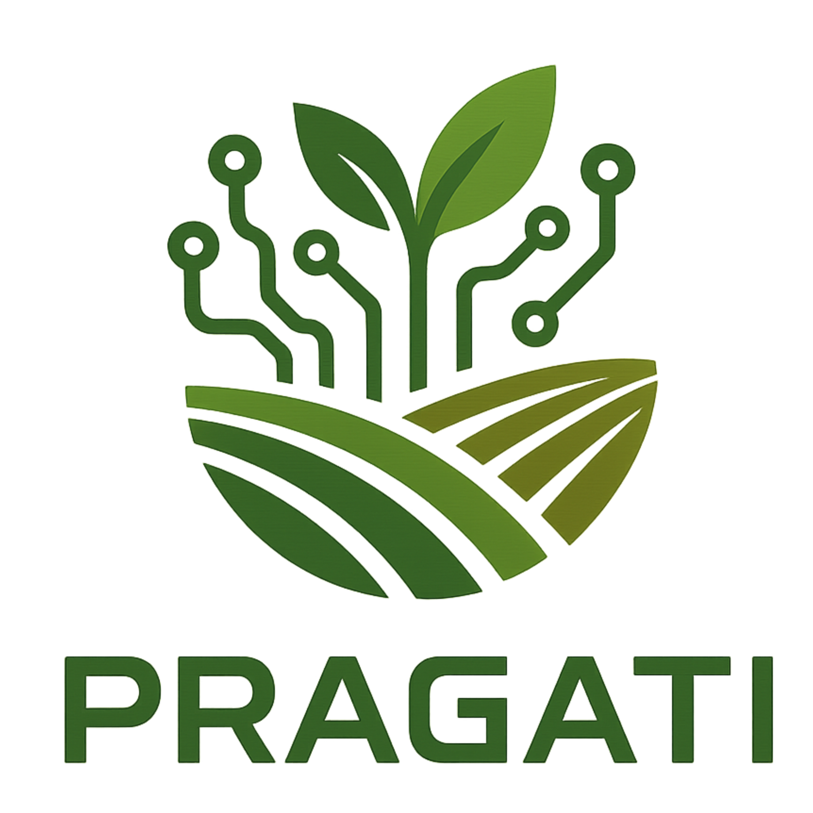

<div align="center">
  
  
  <h1>Agricultural AI Frontend</h1>
  <h3>PRAGATI: Precision Retrieval & AI for Generative Agricultural Technology & Insights</h3>
</div>

---

PRAGATI is a pioneering RAG-powered Multi-Agent Orchestrator System tailored for agricultural domain knowledge. Our vision is to empower the agricultural sector with:

- **Specialized AI Agents**: Deliver precise, timely, and context-aware recommendations for crop selection, irrigation, fertilizer use, pest detection etc.
- **Query Complexity Assessment**: Optimizes retrieval and generation, ensuring the right expertise is applied to each query.
- **Multi-Agent Orchestration**: Coordinates specialized agents for comprehensive, expert-backed answers.
- **Multi-Lingual & Multi-Modal Support**: Accessible via text, image, and voice inputs, making PRAGATI an AI truly "For the Farmers".
- **Deep Research Pipelines**: Enhance coverage and depth of recommendations.
- **Human-in-the-Loop (HITL) Validation**: Ensures factual accuracy and reliable decision support for farmers and stakeholders.
- **Retrieval-Augmented Generation (RAG) Pipeline**: Integrates semantic search with domain-specific knowledge base retrieval, ensuring all AI-generated responses are grounded in verified agricultural data.

> PRAGATI is accurate, fast, and reliable—driving progress and growth in agriculture, just as its name means!

---

A modern Next.js front-end application for Agricultural AI solutions, including chat, crop recommendations, disease prediction, and more.


## Features

The dashboard provides the following AI-powered features and tools:

- **AI Specialists Tab**
  - Crop Yield Prediction
  - Crop Health Analysis & Disease Prediction
  - Pest Control & Prediction
  - Crop Recommendations (Soil-based)
  - Fertilizer Guide
  - Irrigation Planning
  - Weather Advisory
  - Market Prices (Real-time)
  - Credit Policy & Market Intelligence
  - Risk Management
  - Agriculture News & Updates

- **Chat History Tab**
  - Access and revisit all your previous chat sessions with AI agents.

- **QR Scanner**
  - Scan QR codes for quick access to agri-data, resources, or field records.

- **Profile & Sign Out**
  - Manage your user profile and securely sign out.

All features are accessible via a sidebar for seamless navigation between AI agents, chat history, and tools.

## Table of Contents

## Prerequisites
- [Node.js](https://nodejs.org/) v18 or higher
- [pnpm](https://pnpm.io/) package manager (optional but recommended)
- A PostgreSQL-compatible database (Neon, Supabase, or local Postgres)
- [Git](https://git-scm.com/) for version control

## Getting Started
1. Clone the repository:
   ```bash
   git clone https://github.com/Ecolash/Agricultural-AI-Frontend.git
   cd Agricultural-AI-Frontend
   ```

2. Install dependencies:
   ```bash
   pnpm install
   ```

3. Create a `.env` file in the project root based on the example below.

## Environment Variables
Create a `.env` file with the following variables:
In the project root:

```env
DATABASE_URL=""           # PostgreSQL connection string
NEXTAUTH_SECRET=""        # Secret key for NextAuth.js
NEXTAUTH_URL=""           # Deployed frontend URL
NEXT_PUBLIC_API_URL=""    # Public API endpoint for the backend
```

## Prisma Setup
Prisma ORM is used for database schema migrations and client generation.

1. Generate Prisma client (runs automatically after install):
   ```bash
   pnpm prisma generate
   ```

2. Apply migrations to your database:
   ```bash
   pnpm prisma migrate dev --name init
   ```

3. (Optional) To reset your database and reapply all migrations:
   ```bash
   pnpm prisma migrate reset
   ```

## Available Scripts
In the project directory, you can run:

- `pnpm dev` or `pnpm run dev:frontend`  
  Runs the development server at [http://localhost:3000](http://localhost:3000).

- `pnpm run build`  
  Builds the application for production and generates the Prisma client.

- `pnpm start`  
  Runs the production build with `next start`.

- `pnpm run lint`  
  Lints code with ESLint.

- `pnpm run type-check`  
  Runs TypeScript type checking.

- `pnpm run dev:setup`  
  Helpful scripts for local development (see `scripts/dev-setup.sh help`).

## Project Structure
```
├── app/                        # Next.js app directory (routing, pages, API routes)
│   ├── api/                    # API route handlers (auth, chat-history, etc.)
│   ├── dashboard/              # Dashboard UI and subpages
│   ├── qr-scanner/             # QR scanner feature pages
│   ├── signin/, signup/        # Auth pages
│   └── ...                     # Other feature pages and layouts
│
├── components/                 # Reusable React components
│   ├── agent-interfaces/       # Specialized agent UI interfaces
│   ├── lib/                    # Component-specific utilities
│   ├── types/                  # Component-specific types
│   └── ui/                     # UI primitives (buttons, dialogs, etc.)
│
├── data/                       # Static data, language lists, agent configs
├── docs/                       # Project and API documentation
├── hooks/                      # Custom React hooks
├── lib/                        # API wrappers, utilities, and services
│   └── actions/                # Server actions and helpers
├── prisma/                     # Prisma schema and migrations
│   └── migrations/             # Database migration files
├── public/                     # Static assets (images, icons, etc.)
├── scripts/                    # Utility scripts for setup and development
├── styles/                     # Global and component styles
├── types/                      # Global TypeScript type definitions
├── assets/                     # Project assets (logo, images)
├── .env                        # Environment variables
├── package.json                # Project metadata and scripts
├── tsconfig.json               # TypeScript configuration
├── README.md                   # Project documentation
└── ...                         # Other config and dotfiles
```

## Contributing
Contributions are welcome! Please open an issue or submit a pull request.

1. Fork the repository
2. Create your feature branch (`git checkout -b feature/my-feature`)
3. Commit your changes (`git commit -m 'feat: add my feature'`)
4. Push to the branch (`git push origin feature/my-feature`)
5. Open a Pull Request

## License
This project is licensed under the MIT License. See the [LICENSE](LICENSE) file for details.
